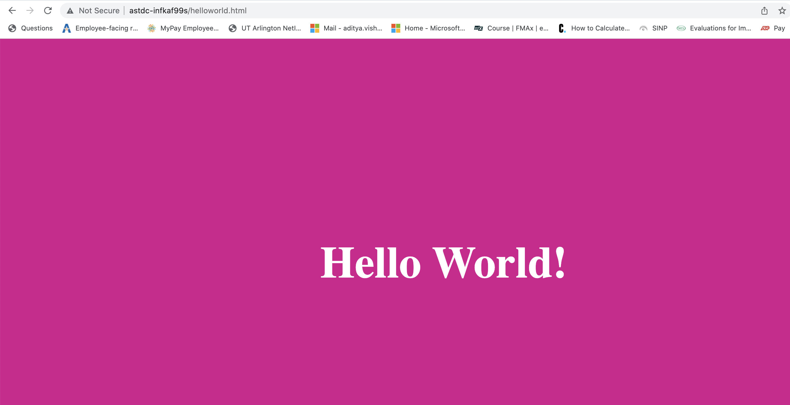

Updated: August 4, 2022

Getting started with ansible and create a ansible playbook for linux server
=========================

## **Introduction**
This is the first of several labs that are part of the Dimensional Ansible workshop. This workshop will walk you through the process of creating a ansible playbook that can be used to manage configuration on linux and windows servers.

Ansible is an agentless automation solution for configuration management and provisioning components (ex. network, server) in a hybrid environment (ex. on-prem, cloud, virtual and physical).  Ansible uses OpenSSH (Linux OS) and WinRM (Microsoft OS).

Ansible uses an automation engine that runs playbooks.  Playbooks contain Plays and Plays contain Tasks that are triggered by Handlers.

Ansible playbooks is where the code instructions are written in yaml format (human readable format).  The instructions in a playbook are Plays, Tasks, etc.  For more complex requirements, variables can be used by sourcing from playbooks, files, inventories, command-line, discovered variables (facts) and Ansible Tower.


## Objectives

- Create a simple ansible playbook to install nginx package and host static website on the server
- Create ansible inventory.
- Add a task to install nginx package.
- Restart nginx service using ansible.

### Prerequisites

Before we begin you will need to have installed Ansible on your local machine and have access to a remote linux server.
- Python3
- Ansible - [Installation guide](https://docs.ansible.com/ansible/latest/installation_guide/intro_installation.html)
- Add ssh key to your remote server 
  - Command to generate ssh keys - ssh-keygen
  - AWX template to add your public key to the server - [Add user and public key](http://astof-k8s01d:32321/#/templates/job_template/44/details)
----------------------------------------------------------------------------

### **Step 1**: Create Inventory File

- First, we will create a folder to store the Ansible files in.

```
cd
mkdir ansible && cd ansible
```

- Create a file called inventory.yml then add the following:
Replace *Hostname* with the name of your server and *USER_ID* with your username

```
web:
  hosts:
    Hostname
  vars:
    ansible_user: USER_ID
    ansible_ssh_private_key_file: ~/.ssh/id_rsa
```

### **Step 2**: Create HTML File

- Create a folder to store the example static website.

```
mkdir templates
```

- Add a html file called *helloworld.html.j2* to the folder:
```
<!DOCTYPE html>
<html lang="en">
  <title> </title>
  <meta name="viewport" content="width=device-width, initial-scale=1">
  <link rel="stylesheet" href="https://unpkg.com/tachyons/css/tachyons.min.css">
  <body>
    <article class="vh-100 dt w-100 bg-dark-pink">
      <div class="dtc v-mid tc white ph3 ph4-l">
        <h1 class="f6 f2-m f-subheadline-l fw6 tc">Hello World!</h1>
      </div>
    </article>
  </body>
</html>
```


### **Step 3**: Create NGINX Playbook

- Create a playbook called *nginx.yml* and add the following:

```
- hosts: web
  become: yes
  tasks:

  - name: "install nginx"
    yum:
      name: ['nginx']
      state: latest

  - name: copy html file
    template:
      src: helloworld.html.j2
      dest: /usr/share/nginx/html/helloworld.html
      owner: root
      group: root
      mode: '0644'
    notify: restart nginx

  handlers:
    - name: restart nginx
      service:
        name: nginx
        state: restarted
``` 


### **Step 4**: Run Playbook and Test Site

- Run the playbook to install and configure NGINX:

```
ansible-playbook -i inventory.yml nginx.yml
```


- Open a web browser and test the website works by browsing to
```
http://astdc-infkaf99s/helloworld.html
```

